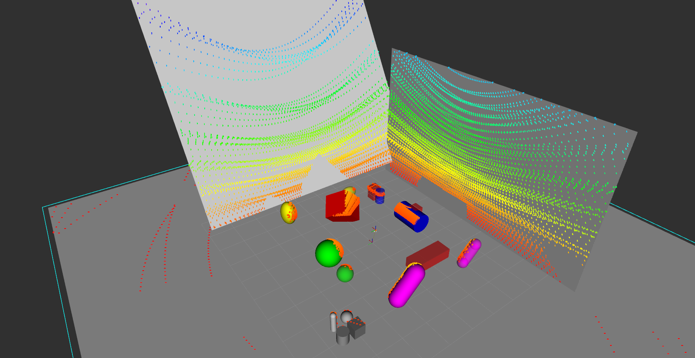
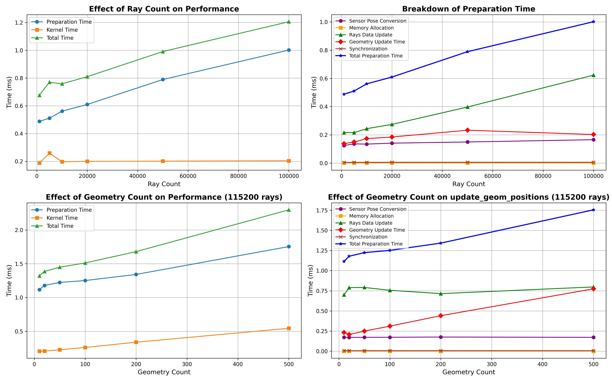
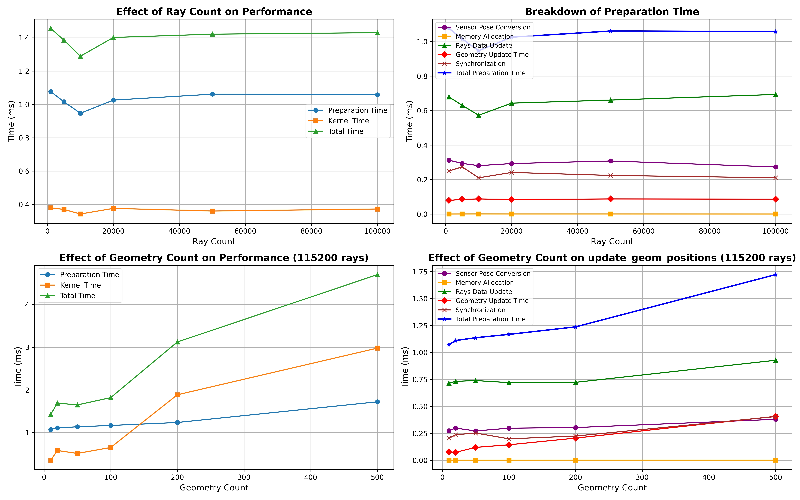
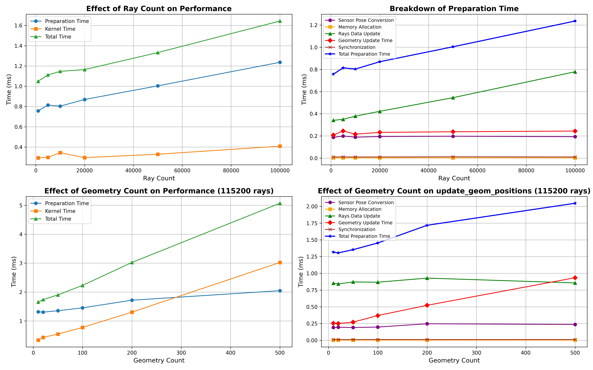

# MJ-LiDAR: High-Performance LiDAR Simulation for MuJoCo

A high-performance LiDAR simulation tool designed for MuJoCo, powered by Taichi programming language.



[toc]

## 🌟 Features

- **GPU-Accelerated**: Uses Taichi for efficient parallel computing on GPUs
- **High Performance**: Can generate 1,000,000+ rays in milliseconds
- **Multiple LiDAR Models**: Supports various LiDAR scan patterns:
  - Livox non-repetitive scanning: mid360, mid70, mid40, tele, avia
  - Velodyne HDL-64E, VLP-32C
  - Ouster OS-128
  - Customizable grid scan pattern
- **Accurate Physics**: Ray-casting against all MuJoCo geometry types: boxes, spheres, ellipsoids, cylinders, capsules and planes
- **ROS Integration**: Ready-to-use examples for both ROS1 and ROS2

## 🔧 Installation

### Requirements

- Python >= 3.8
- MuJoCo >= 3.2.0
- Taichi >= 1.6.0
- NumPy >= 1.20.0

### Quick Install

```bash
# Clone the repository
git clone https://github.com/TATP-233/MuJoCo-LiDAR.git
cd MuJoCo-LiDAR

# Install with pip
pip install -e .
```

## 📚 Usage Examples

### Basic Usage

MJ-LiDAR provides two ways to use the library: directly through the core `MjLidarSensor` class or via the more user-friendly `MjLidarWrapper` class. The following examples showcase the wrapper class, which is more suitable for beginners.

#### Simple Example: Adding LiDAR to a MuJoCo Environment

Here's a complete example `examples/simple_demo.py` showing how to add a LiDAR to a MuJoCo environment and visualize the point cloud:

```python
import time
import threading
import mujoco
import mujoco.viewer
import matplotlib.pyplot as plt

# Import LiDAR wrapper and scan pattern generator
from mj_lidar.lidar_wrapper import MjLidarWrapper
from mj_lidar.scan_gen import generate_grid_scan_pattern

# 1. Define a simple MuJoCo scene (with various geometries and LiDAR site)
simple_demo_scene = """
<mujoco model="simple_demo">
    <worldbody>
        <!-- Ground + four walls -->
        <geom name="ground" type="plane" size="5 5 0.1" pos="0 0 0" rgba="0.2 0.9 0.9 1"/>
        <geom name="wall1" type="box" size="1e-3 3 1" pos=" 3 0 1" rgba="0.9 0.9 0.9 1"/>
        <geom name="wall2" type="box" size="1e-3 3 1" pos="-3 0 1" rgba="0.9 0.9 0.9 1"/>
        <geom name="wall3" type="box" size="3 1e-3 1" pos="0  3 1" rgba="0.9 0.9 0.9 1"/>
        <geom name="wall4" type="box" size="3 1e-3 1" pos="0 -3 1" rgba="0.9 0.9 0.9 1"/>

        <!-- Different geometries -->
        <geom name="box1" type="box" size="0.5 0.5 0.5" pos="2 0 0.5" euler="45 -45 0" rgba="1 0 0 1"/>
        <geom name="sphere1" type="sphere" size="0.5" pos="0 2 0.5" rgba="0 1 0 1"/>
        <geom name="cylinder1" type="cylinder" size="0.4 0.6" pos="0 -2 0.4" euler="0 90 0" rgba="0 0 1 1"/>
        <geom name="ellipsoid1" type="ellipsoid" size="0.4 0.3 0.5" pos="2 2 0.5" rgba="1 1 0 1"/>
        <geom name="capsule1" type="capsule" size="0.3 0.5" pos="-1 1 0.8" euler="45 0 0" rgba="1 0 1 1"/>
        
        <!-- LiDAR site - Important! The site tag is used to position the LiDAR -->
        <!-- Note: mocap="true" is used for user interaction. For robots with physical bodies, this option is not needed -->
        <body name="lidar_base" pos="0 0 1" quat="1 0 0 0" mocap="true">
            <inertial pos="0 0 0" mass="1e-4" diaginertia="1e-9 1e-9 1e-9"/>
            <site name="lidar_site" size="0.001" type='sphere'/>
            <geom type="box" size="0.1 0.1 0.1" density="0" contype="0" conaffinity="0" rgba="0.3 0.6 0.3 0.2"/>
        </body>
    </worldbody>
</mujoco>
"""

# 2. Create MuJoCo model and data
mj_model = mujoco.MjModel.from_xml_string(simple_demo_scene)    
mj_data = mujoco.MjData(mj_model)

# 3. Generate scan pattern (you can choose different LiDAR models)
# Here we create a simple grid scan pattern, 64 horizontal lines and 16 vertical lines
rays_theta, rays_phi = generate_grid_scan_pattern(num_ray_cols=64, num_ray_rows=16)

# 4. Create LiDAR sensor wrapper
# Note: site_name parameter must match the <site name="lidar_site"> in the MJCF file
lidar_sim = MjLidarWrapper(mj_model, mj_data, site_name="lidar_site")

# 5. Perform ray casting to get point cloud data
points = lidar_sim.get_lidar_points(rays_phi, rays_theta, mj_data)

# 6. Set visualization update rate
lidar_sim_rate = 10
lidar_sim_cnt = 0

# 7. Create 3D point cloud visualization thread
def plot_points_thread():
    global points, lidar_sim_rate
    plt.ion()  # Enable interactive mode
    fig = plt.figure()
    ax = fig.add_subplot(111, projection='3d')
    ax.set_box_aspect([1, 1, 0.3])  # Set equal aspect ratio for all axes

    while True:
        ax.cla()  # Clear current axes
        ax.scatter(points[:, 0], points[:, 1], points[:, 2], c=points[:, 2], cmap='viridis', s=3)
        plt.draw()  # Update plot
        plt.pause(1./lidar_sim_rate)  # Pause to update figure

# Start point cloud visualization thread
plot_points_thread = threading.Thread(target=plot_points_thread)
plot_points_thread.start()

# 8. Main loop - Use MuJoCo viewer and update LiDAR scan
with mujoco.viewer.launch_passive(mj_model, mj_data) as viewer:
    # Set view mode to site
    viewer.opt.frame = mujoco.mjtFrame.mjFRAME_SITE.value
    viewer.opt.label = mujoco.mjtLabel.mjLABEL_SITE.value
    viewer.cam.distance = 5.  # Set camera distance

    # Simulation main loop
    while viewer.is_running:
        # Update physics simulation
        mujoco.mj_step(mj_model, mj_data)
        viewer.sync()
        time.sleep(1./60.)

        # Update LiDAR point cloud at specified rate
        if mj_data.time * lidar_sim_rate > lidar_sim_cnt:
            # Update LiDAR scene
            lidar_sim.update_scene(mj_model, mj_data)

            # Perform ray casting, get new point cloud
            points = lidar_sim.get_lidar_points(rays_phi, rays_theta, mj_data)
            
            # Output point cloud basic information (only in first loop)
            if lidar_sim_cnt == 0:
                print("points basic info:")
                print("  .shape:", points.shape)
                print("  .dtype:", points.dtype)
                print("  x.min():", points[:, 0].min(), "x.max():", points[:, 0].max())
                print("  y.min():", points[:, 1].min(), "y.max():", points[:, 1].max())
                print("  z.min():", points[:, 2].min(), "z.max():", points[:, 2].max())

            lidar_sim_cnt += 1

# Wait for visualization thread to finish
plot_points_thread.join()
```

Run the program to see the effects:

```bash
python examples/simple_demo.py

# In mujoco.viewer, double-click to select the red box where lidar_site is located. Hold Ctrl and right-click drag to move the red box,
# Hold Ctrl and left-click drag to rotate the red box, while observing the position changes of the lidar points in the `Figure 1` window of matplotlib
# This shows that the points are relative to the local lidar_site coordinate system, not the global coordinate system
```

### Using LiDAR in Your Own MuJoCo Environment

If you want to use the LiDAR in your own MuJoCo environment, follow these steps:

1. **Add a LiDAR site to your MJCF file**:
   ```xml
   <!-- Add this code at an appropriate location in your MJCF file -->
   <body name="your_robot_name" pos="0 0 1" quat="1 0 0 0">
     <site name="lidar_site" size="0.001" type='sphere'/>
   </body>
   ```

2. **Choose an appropriate LiDAR scan pattern**:
   ```python
   from mj_lidar.scan_gen import (
       generate_HDL64,          # Velodyne HDL-64E pattern
       generate_vlp32,          # Velodyne VLP-32C pattern
       generate_os128,          # Ouster OS-128 pattern
       LivoxGenerator,          # Livox series LiDARs
       generate_grid_scan_pattern  # Custom grid scan pattern
   )
   
   # Choose one of the following LiDAR scan patterns:
   
   # 1. Use Velodyne HDL-64E (64-line rotating LiDAR)
   rays_theta, rays_phi = generate_HDL64()
   
   # 2. Use Velodyne VLP-32C (32-line LiDAR)
   rays_theta, rays_phi = generate_vlp32()
   
   # 3. Use Ouster OS-128 (128-line LiDAR)
   rays_theta, rays_phi = generate_os128()
   
   # 4. Use Livox series non-repetitive scan pattern
   # Note: Other scanning methods use fixed ray angles that only need to be generated once, 
   # but Livox series uses non-repetitive scanning, so you need to call `livox_generator.sample_ray_angles()`
   # before each `lidar_sim.get_lidar_points` call
   livox_generator = LivoxGenerator("mid360")  # Options: "avia", "mid40", "mid70", "mid360", "tele"
   rays_theta, rays_phi = livox_generator.sample_ray_angles()
   
   # 5. Use custom grid scan pattern (horizontal x vertical resolution)
   rays_theta, rays_phi = generate_grid_scan_pattern(
       num_ray_cols=180,  # Horizontal resolution
       num_ray_rows=32,   # Vertical resolution
       theta_range=(-np.pi, np.pi),    # Horizontal scan range (radians)
       phi_range=(-np.pi/6, np.pi/6)   # Vertical scan range (radians)
   )
   ```

3. **Create LiDAR wrapper and get point cloud**:
   ```python
   # Create mujoco model and data
   mj_model = mujoco.MjModel.from_xml_path('/path/to/mjcf.xml')
   mj_data = mujoco.MjData(mj_model)
   
   # Initialize LiDAR wrapper
   # The site_name parameter must match the site name in your MJCF file
   lidar_sim = MjLidarWrapper(
       mj_model, 
       mj_data, 
       site_name="lidar_site",  # Match with <site name="..."> in MJCF
       args={
           "enable_profiling": False,  # Enable performance profiling (optional)
           "verbose": False           # Show detailed information (optional)
       }
   )
   
   # In simulation loop, get LiDAR point cloud
    with mujoco.viewer.launch_passive(mj_model, mj_data) as viewer:
       while True:
           # Update physics simulation
           mujoco.mj_step(mj_model, mj_data)
           
           # Usually mj_step frequency is much higher than lidar simulation frequency, 
           # it's better to reduce the LiDAR simulation frequency here
           # Update LiDAR scene
           lidar_sim.update_scene(mj_model, mj_data)
           
           # Perform ray casting to get point cloud
           points = lidar_sim.get_lidar_points(rays_phi, rays_theta, mj_data)
           
           # Process point cloud data...
   ```

## 🤖 ROS Integration

### ROS1 Example

```bash
# First terminal
roscore

# Second terminal
python examples/lidar_vis_ros1.py

# Third terminal - Use RViz to visualize scene and point cloud
rosrun rviz rviz -d examples/config/rviz_config.rviz
```

This publishes LiDAR scans as PointCloud2 messages on the `/lidar_points` topic.

#### ROS1 Example Command Line Arguments

`lidar_vis_ros1.py` supports the following command line arguments:

```bash
python examples/lidar_vis_ros1.py [options]

Options:
  --lidar MODEL      Specify LiDAR model, available options:
                     - Livox series: avia, mid40, mid70, mid360, tele
                     - Velodyne series: HDL64, vlp32
                     - Ouster series: os128
                     Default: mid360
  --profiling        Enable performance profiling, showing timing statistics for ray tracing
  --verbose          Show detailed output including position, orientation, and timing information
  --rate HZ          Set point cloud publishing frequency (Hz), default: 12
```

Example: Using HDL64 LiDAR with profiling enabled and publishing rate of 10Hz
```bash
python examples/lidar_vis_ros1.py --lidar HDL64 --profiling --rate 10
```

#### Keyboard Interaction

In the ROS examples, you can use the keyboard to control the LiDAR position and orientation:
- `W/A/S/D`: Control horizontal movement (forward/left/backward/right)
- `Q/E`: Control height up/down
- `↑/↓`: Control pitch angle
- `←/→`: Control yaw angle
- `ESC`: Exit program

### ROS2 Example

```bash
# First terminal
python examples/lidar_vis_ros2.py

# Second terminal - Use RViz2 to visualize scene and point cloud
ros2 run rviz2 rviz2 -d examples/config/rviz_config.rviz
```

This publishes LiDAR scans as PointCloud2 messages on the `/lidar_points` topic.

#### ROS2 Example Command Line Arguments

`lidar_vis_ros2.py` supports the same command line arguments as the ROS1 example:

```bash
python examples/lidar_vis_ros2.py [options]

Options:
  --lidar MODEL      Specify LiDAR model, same options as ROS1 example
  --profiling        Enable performance profiling
  --verbose          Show detailed output
  --rate HZ          Set point cloud publishing frequency (Hz), default: 12
```

Keyboard controls are the same as in ROS1.

## 📈 Performance Testing

Run the performance test to benchmark the LiDAR simulation:

```bash
python examples/test_speed.py --profiling --verbose
```

This will test 115,200 rays (equivalent to 1800×64 resolution) and show detailed timing information.

Performance test script supports the following parameters:
- `--profiling`: Enable performance profiling, showing detailed timing statistics
- `--verbose`: Show more debug information
- `--skip-test`: Skip performance test, only show demonstration
- `--zh`: Use Chinese for charts
- `--save-fig`: Save charts

We tested the performance on three different computers, including a MacBook (yes :) our program is cross-platform like MuJoCo).

In scenes with fewer geoms (<200), simulating with 115,200 rays can achieve 500Hz+ simulation efficiency, which is really fast! Most of the time is spent in the preparation process, with a large proportion (>60%) spent copying data from CPU to GPU.

| Desktop PC<br />Intel Xeon w5-3435X<br />Nvidia 6000Ada    | MacBook M3Max 48GB<br /> | Lenovo Legion R9000P 2022<br />R7-5800H<br />Nvidia RTX 3060 |
| :----------------------------------------------------------: | :----------------: | :---------------------------------------: |
|  |  |  |

## 📄 License

This project is licensed under the MIT License - see the [LICENSE](LICENSE) file for details.


