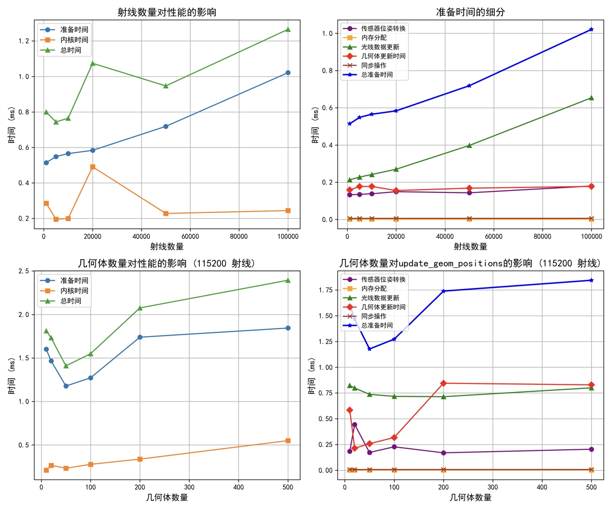
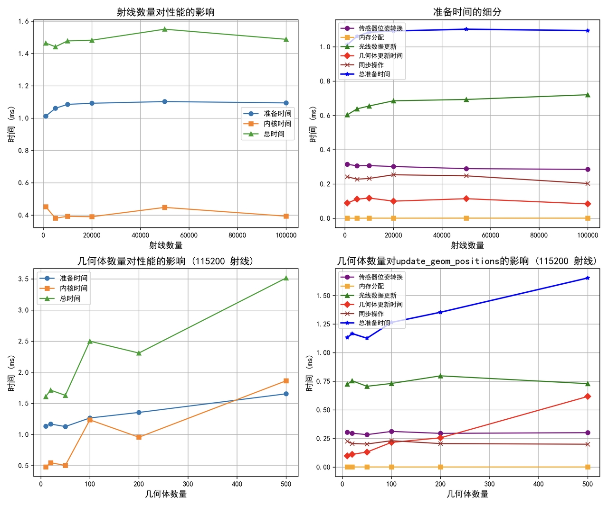
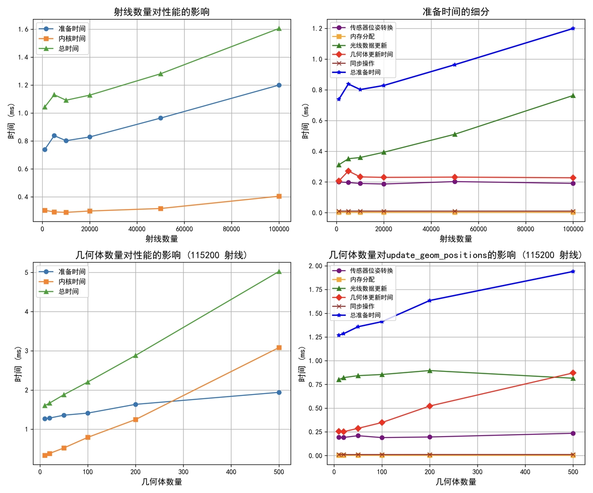

# MuJoCo-LiDAR: 基于MuJoCo的高性能激光雷达仿真

基于MuJoCo的高性能激光雷达仿真工具，由Taichi编程语言提供强大的并行计算支持。


[toc]

## 🌟 特点

- **GPU加速**：利用Taichi实现GPU高效并行计算
- **高性能**：能在毫秒级生成100万+射线
- **多种激光雷达模型**：支持多种扫描模式：
  - Livox非重复扫描模式: mid360 mid70 mid40 tele avia
  - Velodyne HDL-64E、VLP-32C
  - Ouster OS-128
  - 可自定义网格扫描模式
- **精确的物理模拟**：对所有MuJoCo几何体类型进行射线追踪：盒体、球体、椭球体、圆柱体、胶囊体和平面
- **ROS集成**：提供即用型ROS1和ROS2示例

## 🔧 安装

### 系统要求

- Python >= 3.8
- MuJoCo >= 3.2.0
- Taichi >= 1.6.0
- NumPy >= 1.20.0

### 快速安装

```bash
# 克隆仓库
git clone https://github.com/TATP-233/MuJoCo-LiDAR.git
cd MuJoCo-LiDAR

# 使用pip安装
pip install -e .
```

## 📚 使用示例

### 基本使用方法

MJ-LiDAR提供了两种使用方式：直接使用核心的`MjLidarSensor`类或通过更友好的`MjLidarWrapper`包装类。以下示例将展示包装类的使用方法，它更适合初学者。

#### 简单示例：在MuJoCo环境中添加激光雷达

下面是一个完整的示例`examples/simple_demo.py`，展示如何在MuJoCo环境中添加激光雷达并可视化点云：

```python
import time
import threading
import mujoco
import mujoco.viewer
import matplotlib.pyplot as plt

# 导入激光雷达包装类和扫描模式生成函数
from mj_lidar.lidar_wrapper import MjLidarWrapper
from mj_lidar.scan_gen import generate_grid_scan_pattern

# 1. 定义简单的MuJoCo场景（包含不同几何体和激光雷达站点）
simple_demo_scene = """
<mujoco model="simple_demo">
    <worldbody>
        <!-- 地面+四面墙 -->
        <geom name="ground" type="plane" size="5 5 0.1" pos="0 0 0" rgba="0.2 0.9 0.9 1"/>
        <geom name="wall1" type="box" size="1e-3 3 1" pos=" 3 0 1" rgba="0.9 0.9 0.9 1"/>
        <geom name="wall2" type="box" size="1e-3 3 1" pos="-3 0 1" rgba="0.9 0.9 0.9 1"/>
        <geom name="wall3" type="box" size="3 1e-3 1" pos="0  3 1" rgba="0.9 0.9 0.9 1"/>
        <geom name="wall4" type="box" size="3 1e-3 1" pos="0 -3 1" rgba="0.9 0.9 0.9 1"/>

        <!-- 不同几何体 -->
        <geom name="box1" type="box" size="0.5 0.5 0.5" pos="2 0 0.5" euler="45 -45 0" rgba="1 0 0 1"/>
        <geom name="sphere1" type="sphere" size="0.5" pos="0 2 0.5" rgba="0 1 0 1"/>
        <geom name="cylinder1" type="cylinder" size="0.4 0.6" pos="0 -2 0.4" euler="0 90 0" rgba="0 0 1 1"/>
        <geom name="ellipsoid1" type="ellipsoid" size="0.4 0.3 0.5" pos="2 2 0.5" rgba="1 1 0 1"/>
        <geom name="capsule1" type="capsule" size="0.3 0.5" pos="-1 1 0.8" euler="45 0 0" rgba="1 0 1 1"/>
        
        <!-- 激光雷达站点 - 重要！site标签用于定位激光雷达位置 -->
        <!-- 注意此处的mocap="ture"是用来做用户交互的 对于具有实体的机器人 无需设置这一选项 -->
        <body name="lidar_base" pos="0 0 1" quat="1 0 0 0" mocap="true">
            <inertial pos="0 0 0" mass="1e-4" diaginertia="1e-9 1e-9 1e-9"/>
            <site name="lidar_site" size="0.001" type='sphere'/>
            <geom type="box" size="0.1 0.1 0.1" density="0" contype="0" conaffinity="0" rgba="0.3 0.6 0.3 0.2"/>
        </body>
    </worldbody>
</mujoco>
"""

# 2. 创建MuJoCo模型和数据
mj_model = mujoco.MjModel.from_xml_string(simple_demo_scene)    
mj_data = mujoco.MjData(mj_model)

# 3. 生成扫描模式（可以选择不同类型的激光雷达模式）
# 这里创建简单的网格扫描模式，水平64线，垂直16线
rays_theta, rays_phi = generate_grid_scan_pattern(num_ray_cols=64, num_ray_rows=16)

# 4. 创建激光雷达传感器包装类
# 注意：site_name参数必须与MJCF文件中的<site name="lidar_site">匹配
lidar_sim = MjLidarWrapper(mj_model, mj_data, site_name="lidar_site")

# 5. 执行光线追踪，获取点云数据
points = lidar_sim.get_lidar_points(rays_phi, rays_theta, mj_data)

# 6. 设置可视化更新频率
lidar_sim_rate = 10
lidar_sim_cnt = 0

# 7. 创建3D点云可视化线程
def plot_points_thread():
    global points, lidar_sim_rate
    plt.ion()  # 开启交互模式
    fig = plt.figure()
    ax = fig.add_subplot(111, projection='3d')
    ax.set_box_aspect([1, 1, 0.3])  # 设置三个轴的比例尺

    while True:
        ax.cla()  # 清除当前坐标轴
        ax.scatter(points[:, 0], points[:, 1], points[:, 2], c=points[:, 2], cmap='viridis', s=3)
        plt.draw()  # 更新绘图
        plt.pause(1./lidar_sim_rate)  # 暂停以更新图形

# 启动点云可视化线程
plot_points_thread = threading.Thread(target=plot_points_thread)
plot_points_thread.start()

# 8. 主循环 - 使用MuJoCo查看器并更新激光雷达扫描
with mujoco.viewer.launch_passive(mj_model, mj_data) as viewer:
    # 设置视图模式为site
    viewer.opt.frame = mujoco.mjtFrame.mjFRAME_SITE.value
    viewer.opt.label = mujoco.mjtLabel.mjLABEL_SITE.value
    viewer.cam.distance = 5.  # 设置相机距离

    # 模拟主循环
    while viewer.is_running:
        # 更新物理模拟
        mujoco.mj_step(mj_model, mj_data)
        viewer.sync()
        time.sleep(1./60.)

        # 按照指定频率更新激光雷达点云
        if mj_data.time * lidar_sim_rate > lidar_sim_cnt:
            # 更新激光雷达场景
            lidar_sim.update_scene(mj_model, mj_data)

            # 执行光线追踪，获取新的点云
            points = lidar_sim.get_lidar_points(rays_phi, rays_theta, mj_data)
            
            # 输出点云基本信息（仅在第一次循环）
            if lidar_sim_cnt == 0:
                print("points basic info:")
                print("  .shape:", points.shape)
                print("  .dtype:", points.dtype)
                print("  x.min():", points[:, 0].min(), "x.max():", points[:, 0].max())
                print("  y.min():", points[:, 1].min(), "y.max():", points[:, 1].max())
                print("  z.min():", points[:, 2].min(), "z.max():", points[:, 2].max())

            lidar_sim_cnt += 1

# 等待可视化线程结束
plot_points_thread.join()
```

运行程序，查看效果：

```bash
python examples/simple_demo.py

# 在mujoco.viewer中，双击选中lidar_site所在的红色方块，按住Ctrl键，右键鼠标拖动可以平移红色方块，
# 按住Ctrl，左键鼠标拖动可以旋转红色方块，同时观察matplotlib的`Figure 1`界面中的lidar点云的位置变化
# 由此可以发现，points相对的坐标系是本地的lidar_site坐标系，并非全局坐标系
```

### 在自己的MuJoCo环境中使用激光雷达

如果要在你自己的MuJoCo环境中使用激光雷达，需要遵循以下步骤：

1. **在MJCF文件中添加激光雷达站点**：
   ```xml
   <!-- 在你的MJCF文件的适当位置添加以下代码 -->
   <body name="your_robot_name" pos="0 0 1" quat="1 0 0 0">
     <site name="lidar_site" size="0.001" type='sphere'/>
   </body>
   ```

2. **选择合适的激光雷达扫描模式**：
   ```python
   from mj_lidar.scan_gen import (
       generate_HDL64,          # Velodyne HDL-64E 模式
       generate_vlp32,          # Velodyne VLP-32C 模式
       generate_os128,          # Ouster OS-128 模式
       LivoxGenerator,          # Livox系列雷达
       generate_grid_scan_pattern  # 自定义网格扫描模式
   )
   
   # 选择一种雷达扫描模式:
   
   # 1. 使用Velodyne HDL-64E (64线旋转式激光雷达)
   rays_theta, rays_phi = generate_HDL64()
   
   # 2. 使用Velodyne VLP-32C (32线激光雷达)
   rays_theta, rays_phi = generate_vlp32()
   
   # 3. 使用Ouster OS-128 (128线激光雷达)
   rays_theta, rays_phi = generate_os128()
   
   # 4. 使用Livox系列非重复扫描模式
   # 注意 其他扫描方式是固定的射线角度，只需生成一次即可，但是livox系列是非重复式扫描，
   # 每次执行 `lidar_sim.get_lidar_points` 之前都需要执行一次 `livox_generator.sample_ray_angles()`
   livox_generator = LivoxGenerator("mid360")  # 可选: "avia", "mid40", "mid70", "mid360", "tele"
   rays_theta, rays_phi = livox_generator.sample_ray_angles()
   
   # 5. 自定义网格扫描模式 (水平x垂直分辨率)
   rays_theta, rays_phi = generate_grid_scan_pattern(
       num_ray_cols=180,  # 水平分辨率
       num_ray_rows=32,   # 垂直分辨率
       theta_range=(-np.pi, np.pi),    # 水平扫描范围（弧度）
       phi_range=(-np.pi/6, np.pi/6)   # 垂直扫描范围（弧度）
   )
   ```

3. **创建激光雷达包装类并获取点云**：
   ```python
   # 创建mujoco model 和 data
   mj_model = mujoco.MjModel.from_xml_path('/path/to/mjcf.xml')
   mj_data = mujoco.MjData(mj_model)
   
   # 初始化激光雷达包装类
   # site_name参数必须与MJCF文件中的site名称匹配
   lidar_sim = MjLidarWrapper(
       mj_model, 
       mj_data, 
       site_name="lidar_site",  # 与MJCF中的<site name="...">匹配
       args={
           "enable_profiling": False, # 启用性能分析（可选）
           "verbose": False           # 显示详细信息（可选）
       }
   )
   
   # 在模拟循环中获取激光雷达点云
    with mujoco.viewer.launch_passive(mj_model, mj_data) as viewer:
       while True:
           # 更新物理模拟
           mujoco.mj_step(mj_model, mj_data)
           
           # 通常mj_step的频率远高于lidar模拟的频率，此处最好进行分频操作，降低lidar模拟频率
           # 更新激光雷达场景
           lidar_sim.update_scene(mj_model, mj_data)
           
           # 执行光线追踪，获取点云数据
           points = lidar_sim.get_lidar_points(rays_phi, rays_theta, mj_data)
           
           # 处理点云数据...
   ```

## 🤖 ROS集成

### ROS1示例

```bash
# 第一个终端
roscore

# 第二个终端
python examples/lidar_vis_ros1.py

# 第三个终端 使用RViz可视化场景和点云
rosrun rviz rviz -d examples/config/rviz_config.rviz
```

这将在`/lidar_points`话题上发布PointCloud2格式的激光雷达扫描数据。

#### ROS1示例命令行参数

`lidar_vis_ros1.py`支持以下命令行参数：

```bash
python examples/lidar_vis_ros1.py [options]

选项:
  --lidar MODEL      指定激光雷达型号，可选值:
                     - Livox系列: avia, mid40, mid70, mid360, tele
                     - Velodyne系列: HDL64, vlp32
                     - Ouster系列: os128
                     默认值: mid360
  --profiling        启用性能分析，显示射线追踪的时间统计
  --verbose          显示详细输出信息，包括位置、方向和时间信息
  --rate HZ          设置点云发布频率(Hz)，默认值: 12
```

示例：使用HDL64激光雷达，启用性能分析，设置发布频率为10Hz
```bash
python examples/lidar_vis_ros1.py --lidar HDL64 --profiling --rate 10
```

#### 键盘交互

在ROS示例中，您可以使用键盘控制激光雷达的位置和姿态：
- `W/A/S/D`: 控制水平移动（前/左/后/右）
- `Q/E`: 控制高度上升/下降
- `↑/↓`: 控制俯仰角
- `←/→`: 控制偏航角
- `ESC`: 退出程序

### ROS2示例

```bash
# 第一个终端
python examples/lidar_vis_ros2.py

# 第二个终端 使用RViz2可视化场景和点云
ros2 run rviz2 rviz2 -d examples/config/rviz_config.rviz
```

这将在`/lidar_points`话题上发布PointCloud2格式的激光雷达扫描数据。

#### ROS2示例命令行参数

`lidar_vis_ros2.py`支持与ROS1示例相同的命令行参数：

```bash
python examples/lidar_vis_ros2.py [options]

选项:
  --lidar MODEL      指定激光雷达型号，可选值同ROS1示例
  --profiling        启用性能分析
  --verbose          显示详细输出信息
  --rate HZ          设置点云发布频率(Hz)，默认值: 12
```

键盘操作和ROS1一致。

## 📈 性能测试

运行性能测试以评估激光雷达仿真性能：

```bash
python examples/test_speed.py --profiling --verbose
```

这将测试115,200射线（相当于1800×64分辨率）的性能，并显示详细的计时信息。

性能测试程序支持的参数：
- `--profiling`: 启用性能分析，显示详细的时间统计
- `--verbose`: 显示更多调试信息
- `--skip-test`: 跳过性能测试，只显示演示
- `--zh`: 图表使用中文
- `--save-fig`: 保存图表

在三款不同配置电脑上测试了性能，其中甚至包含一台MacBook（是的 :) 我们的程序和MuJoCo一样，是跨平台的）

在较少geom数量（<200）的场景中，使用115,200条射线进行模拟，可以达到500Hz+的仿真效率，这真的是太快了！其中大部分的时间都花在了准备过程中，将数据从cpu拷贝到gpu的时间占了很大的比例（>60%）。

| 台式机<br />Intel Xeon w5-3435X<br />Nvidia 6000Ada    | MacBook M3Max 48GB<br /> | 拯救者 R9000P2022 <br />R7-5800H<br />Nvidia RTX 3060 |
| :----------------------------------------------------------: | :----------------: | :---------------------------------------: |
|  |  |  |

## 📄 许可证

本项目采用MIT许可证 - 详见[LICENSE](LICENSE)文件


