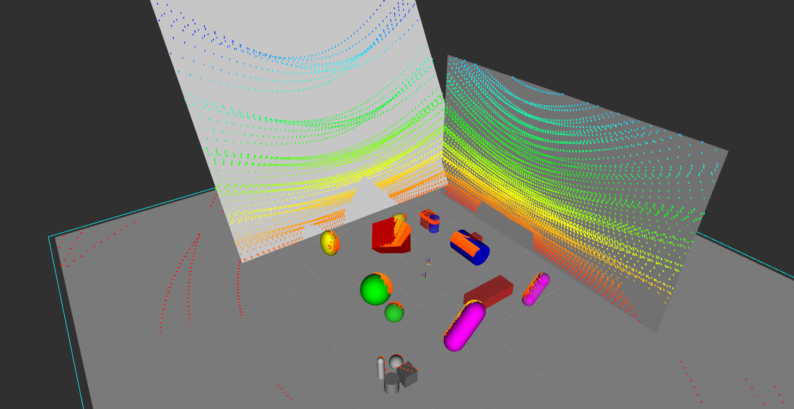

# MuJoCo-LiDAR：基于 MuJoCo 的高性能激光雷达仿真

[](https://pypi.org/project/mujoco-lidar/)
[](https://pypi.org/project/mujoco-lidar/)

基于 MuJoCo 的高性能激光雷达仿真工具，支持 CPU、Taichi、JAX 和 Warp 后端，提供强大的 GPU 并行计算支持。

<p align="center">
  
  
</p>
<p align="center">
  
  
  
</p>

[English](README.md) | [安装指南](docs/zh_CN/INSTALLATION.md) | [使用示例](docs/zh_CN/USAGE.md) | [开发指南](docs/zh_CN/DEVELOPMENT.md)

## 特点

- **多后端支持**：
  - **CPU 后端**：基于 MuJoCo 原生 `mj_multiRay`，无需 GPU，开箱即用
  - **Taichi 后端**：GPU 高效并行计算，支持百万面片 Mesh 场景和高度场
  - **JAX 后端**：GPU 并行计算，支持 MJX 集成和批量仿真
  - **Warp 后端**：基于 NVIDIA Warp，支持动态 Mesh 场景和 batch-scene
- **高性能**：GPU 后端毫秒级生成 100 万+ 射线
- **动态场景**：支持实时 BVH 构建，实现快速 LiDAR 扫描
- **多种激光雷达模型**：
  - Livox 非重复扫描：mid360、mid70、mid40、tele、avia
  - Velodyne HDL-64E、VLP-32C
  - Ouster OS-128
  - 自定义网格扫描模式
- **精确物理模拟**：支持所有 MuJoCo 几何体类型（盒体、球体、椭球体、圆柱体、胶囊体、平面、高度场、Mesh）
- **统一接口**：Wrapper 接口统一封装多个后端
- **ROS 集成**：提供即用型 ROS1/ROS2 示例

## 安装

### 系统要求

- Python >= 3.10
- MuJoCo >= 3.2.0
- NumPy >= 1.20.0

### 快速安装

```bash
# 基础安装（CPU 后端）
uv add mujoco-lidar

# 验证安装
uv run python -c "import mujoco_lidar; print(mujoco_lidar.__version__)"

# 安装 Taichi 后端（需要 NVIDIA GPU）
uv add "mujoco-lidar[taichi]"

# 安装 JAX 后端
uv add "mujoco-lidar[jax]"

# 安装 Warp 后端
uv add "mujoco-lidar[warp]"
```

### 从源码安装

```bash
git clone https://github.com/TATP-233/MuJoCo-LiDAR.git
cd MuJoCo-LiDAR

uv sync --extra dev --extra examples

# 可选 GPU 后端
uv sync --extra dev --extra examples --extra taichi
uv sync --extra dev --extra examples --extra warp
uv sync --extra dev --extra examples --extra taichi --extra jax --extra warp
```

源码安装后可直接运行以下非 ROS 示例：

```bash
# MuJoCo 原生 viewer，CPU 后端
uv run --extra dev --extra examples python examples/example_native.py --backend cpu

# 已安装 Warp 后端时，切换到 Warp
uv run --extra dev --extra examples --extra warp python examples/example_native.py --backend warp

# Unitree Go2，无需 ROS
uv run --extra dev --extra examples --extra warp python examples/unitree_go2.py --backend warp --stand
```

详见 [安装指南](docs/zh_CN/INSTALLATION.md)。

## 快速开始

```python
import mujoco
from mujoco_lidar import MjLidarWrapper, scan_gen

# 加载模型
model = mujoco.MjModel.from_xml_path("scene.xml")
data = mujoco.MjData(model)

# 创建 LiDAR（CPU 后端，也可选 taichi/jax/warp）
lidar = MjLidarWrapper(
    model,
    site_name="lidar_site",
    backend="cpu",
    cutoff_dist=50.0
)

# 生成扫描模式（Velodyne HDL-64E）
theta, phi = scan_gen.generate_HDL64()

# 执行射线追踪
ranges = lidar.trace_rays(data, theta, phi)
print(f"扫描点数：{len(ranges)}")

# 获取点云（局部坐标系）
hit_points = lidar.get_hit_points()
```

更多示例见 [使用示例](docs/zh_CN/USAGE.md)。

## 性能

| 后端    | 射线速度      | 硬件要求 | 批量仿真 |
|---------|--------------|----------|----------|
| CPU     | ~9M rays/s   | 无需 GPU | 否       |
| Taichi  | ~62M rays/s  | NVIDIA GPU | 是     |
| JAX     | ~231M rays/s | GPU      | 是       |
| Warp    | ~100M rays/s | NVIDIA GPU | 是     |

运行基准测试：`make benchmark`

## 文档

- [安装指南](docs/zh_CN/INSTALLATION.md)
- [使用示例](docs/zh_CN/USAGE.md)
- [API 参考](docs/zh_CN/API.md)
- [开发指南](docs/zh_CN/DEVELOPMENT.md)
- [项目结构](docs/zh_CN/PROJECT_STRUCTURE.md)

## 示例

- [examples/example_native.py](examples/example_native.py) — MuJoCo viewer，支持 `--backend cpu|taichi|jax|warp`
- [examples/example_mjcf.py](examples/example_mjcf.py) — MJCF 场景与 Matplotlib 点云显示
- [examples/example_string.py](examples/example_string.py) — 自包含 XML 字符串场景
- [examples/unitree_go2.py](examples/unitree_go2.py) — 无 ROS 的 Unitree Go2 示例，支持 `--backend`
- [examples/unitree_g1.py](examples/unitree_g1.py) — 无 ROS 的 Unitree G1 示例，支持 `--backend`

## 开发

```bash
git clone https://github.com/TATP-233/MuJoCo-LiDAR.git
cd MuJoCo-LiDAR
uv sync --extra dev

make test      # 运行测试
make lint      # 代码质量检查
make benchmark # 性能测试
```

## 许可证

MIT License — 详见 [LICENSE](LICENSE)。

## 引用

如果本项目对您的研究有帮助，请引用：

```bibtex
@software{mujoco_lidar,
  title = {MuJoCo-LiDAR: High-Performance LiDAR Simulation},
  author = {Yufei Jia},
  year = {2024},
  url = {https://github.com/TATP-233/MuJoCo-LiDAR}
}
```
